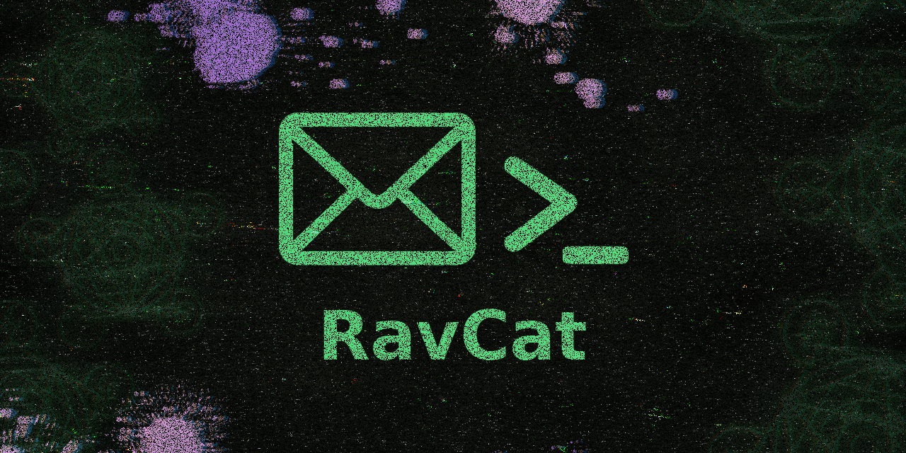

<div align="center">

<a href="https://www.npmjs.com/package/ravcat" target="_blank"></a>  
 <a href="https://www.npmjs.com/package/ravcat" target="_blank"></a>

---

<div align="center">

# 📬 RavCat

[](https://github.com/ravenastar-js/ravcat/stargazers)
[](https://github.com/ravenastar-js/ravcat/network/members)
[](https://www.npmjs.com/package/ravcat)
[](https://nodejs.org)
[](LICENSE)

*Biblioteca NPM + CLI*

</div>



<div align="center">
BANNER INSPIRADO EM
<br>
<a href="https://store.steampowered.com/app/1507580/Enigma_do_Medo" >
  
</a>
</div>

## 🎯 Visão Geral

**RavCat** é uma ferramenta CLI básica desenvolvida para centralizar informações de contato de entidades oficiais relacionadas a phishing, abuso, falsos positivos e muito mais.

Projetada para ser rápida, eficiente e extremamente útil, RavCat atende tanto profissionais da área de segurança cibernética quanto usuários que foram vítimas de incidentes online.

---

## 📦 Instalação Rápida

<details>
<summary>📥 Como instalar o NodeJS?</summary>

- [COMO INSTALAR NODE JS NO WINDOWS?](https://youtu.be/-jft_9PlffQ)
</details>

```
npm i -g ravcat           # ✅ Recomendado
npm install -g ravcat     # ✅ Completo

# Após instalação, use em qualquer lugar:
ravcat --help
```

## 🗑️ DESINSTALAR GLOBALMENTE
```bash
npm un -g ravcat          # ✅ Recomendado  
npm uninstall -g ravcat   # ✅ Completo
npm remove -g ravcat      # ✅ Alternativo
```

### 🐧 Termux (Android)
```
pkg install nodejs
npm install -g ravcat
ravcat
```

### 🔍 Consultas Diretas

#### 📬 Serviços/Empresas
```
ravcat cloudflare
ravcat registro.br
ravcat github
ravcat google
```

#### 🛡️ VirusTotal
```
ravcat --vt microsoft
ravcat --vt kaspersky
ravcat --vt bitdefender
```

### 📊 Listas Completas
```
ravcat --list
ravcat --list-vt
```

## 📋 Comandos Completos

### 🎯 Comandos Principais
| Comando | Descrição | Exemplo |
|---------|-----------|---------|
| `ravcat` | Menu interativo completo | `ravcat` |
| `ravcat <empresa>` | Consulta direta de serviços | `ravcat cloudflare` |
| `ravcat --vt <vendor>` | Consulta direta VirusTotal | `ravcat --vt microsoft` |
| `ravcat --list` | Lista todas as empresas | `ravcat --list` |
| `ravcat --list-vt` | Lista todos os vendors VT | `ravcat --list-vt` |

### ℹ️ Comandos de Informação
| Comando | Descrição | Alternativa |
|---------|-----------|-------------|
| `ravcat --help` | Ajuda completa | `ravcat -h` |
| `ravcat --version` | Versão do sistema | `ravcat -v` |

## 🎯 Exemplos Práticos

### 📝 Denúncia de Phishing
```
# Encontrar contato para reportar phishing
ravcat cloudflare
ravcat hostinger
ravcat github
```

### 🛡️ Reporte de Falso Positivo
```
# Encontrar contato para reportar falso positivo
ravcat --vt microsoft
ravcat --vt kaspersky
ravcat --vt avast
```

### 📊 Listas Completas
```
# Ver todas as empresas disponíveis
ravcat --list

# Ver todos os vendors VirusTotal
ravcat --list-vt
```

## 📁 Estrutura do Projeto

```
📁 ravcat/
├── 📁 bin/
│   └── 🎯 cli.js                       # Ponto de entrada principal
├── 📁 scripts/
│   ├── 🔧 check-environment.js         # Verificador de ambiente
│   └── 📦 postinstall.js               # Script pós-instalação
├── 📁 src/
│   ├── 📁 commands/
│   │   └── 🛠️ index.js                 # Gerenciador de comandos CLI
│   ├── 📁 config/
│   │   ├── 🎨 colors.js                # Sistema de cores do terminal
│   │   ├── ⚙️ config-loader.js         # Carregador de configurações
│   │   └── 📏 constants.js             # Constantes do sistema
│   ├── 📁 data/
│   │   ├── 📡 loader.js                # Carrega dados principal
│   │   └── 🛡️ virustotal-loader.js     # Carrega dados do VirusTotal
│   ├── 📁 menu/
│   │   └── 🎮 main.js                  # Sistema de menus interativos
│   ├── 📁 renderer/
│   │   ├── 📦 box.js                   # Renderizador de caixas
│   │   ├── 🏷️ header.js                # Renderizador de cabeçalhos
│   │   └── 📋 menu.js                  # Renderizador de menus
│   ├── 📁 utils/
│   │   ├── 📄 txt-generator.js         # Gerador de arquivos TXT
│   │   └── 🛡️ vt-txt-generator.js      # Gerador TXT VirusTotal
│   └── 🚀 index.js                     # Classe principal RavCat
├── 📄 .gitignore                       # Arquivos ignorados Git
├── 📄 .npmignore                       # Arquivos ignorados NPM
├── 📄 LICENSE                          # Licença MIT
├── 📖 README.md                        # Documentação
├── 📦 package.json                     # Configurações NPM
└── ⚙️ config.json                      # Configurações da aplicação
```

## 📄 Licença

Este projeto está sob a licença MIT. Veja o arquivo [LICENSE](LICENSE) para detalhes.

---

## 📞 Suporte 

Se precisar de ajuda ou quiser falar com a equipe, entre no nosso servidor de suporte:

[](https://discord.gg/FncVNprdgP)

---

**Feito com 💚 por [RavenaStar](https://ravenastar.link)**

---

## Star History

<a href="https://www.star-history.com/#ravenastar-js/ravcate&Date">
 <picture>
   <source media="(prefers-color-scheme: dark)" srcset="https://api.star-history.com/svg?repos=ravenastar-js/ravcate&type=Date&theme=dark" />
   <source media="(prefers-color-scheme: light)" srcset="https://api.star-history.com/svg?repos=ravenastar-js/ravcate&type=Date" />
   
 </picture>
</a>